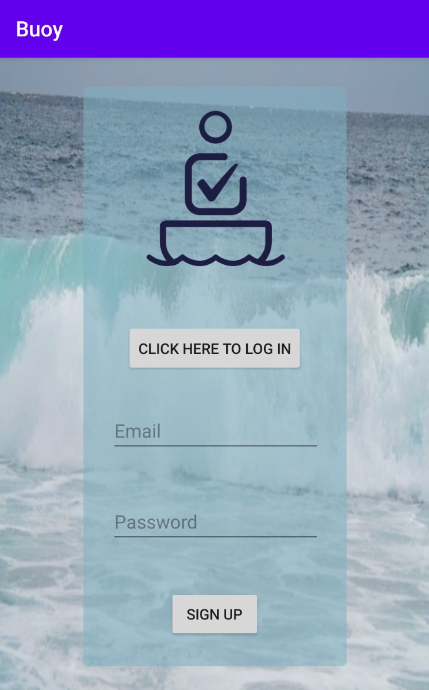
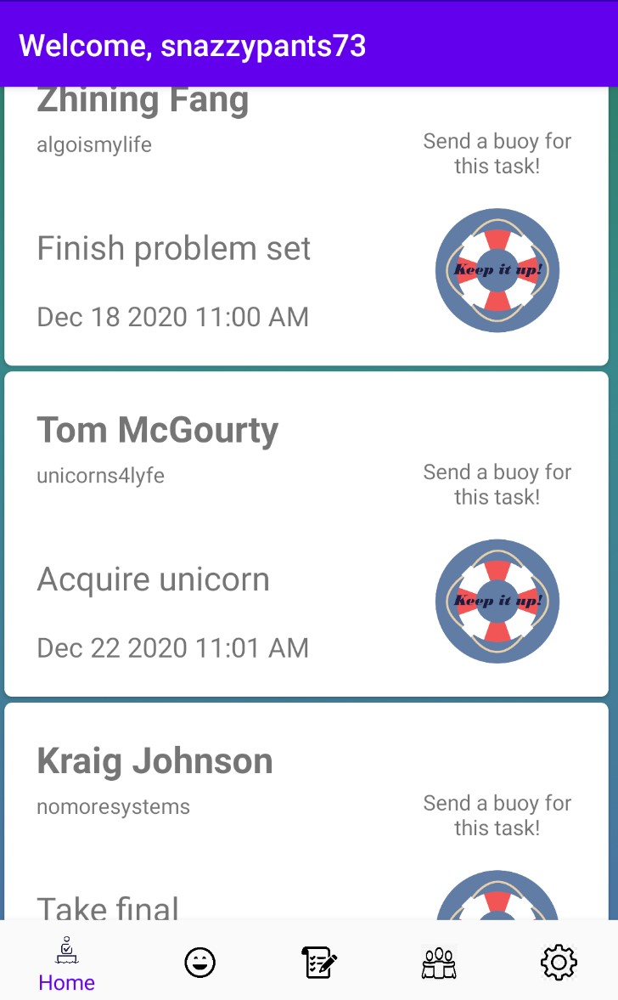
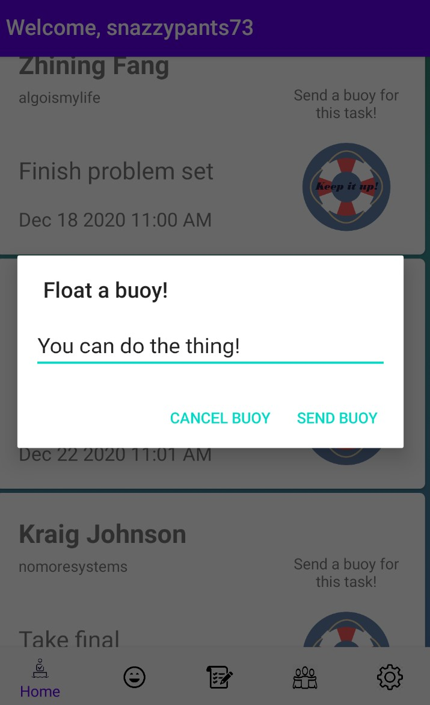
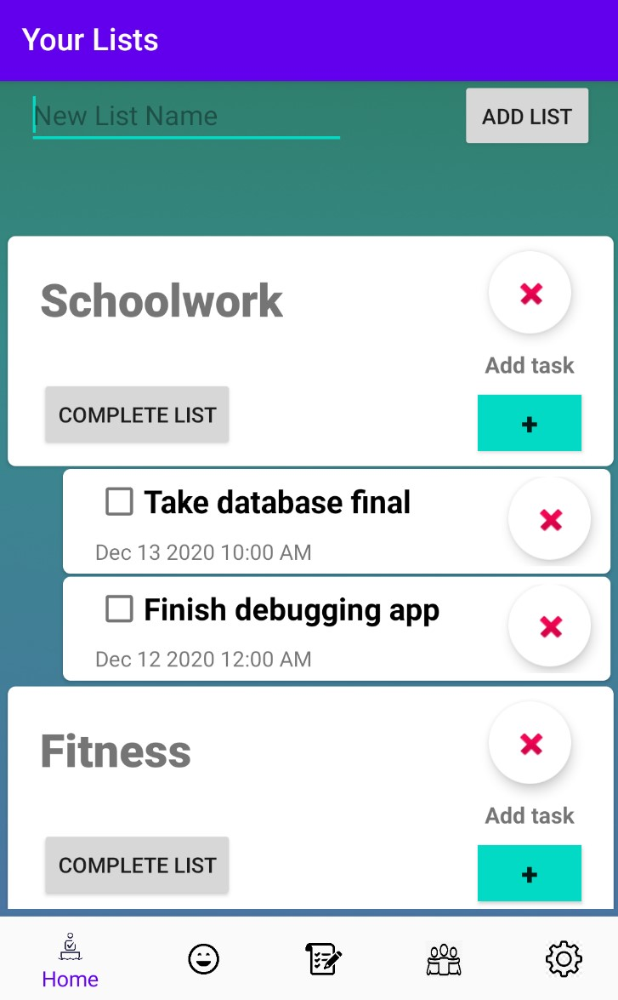
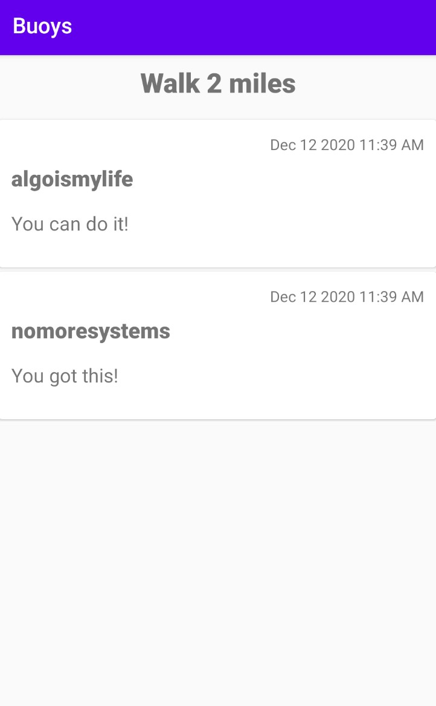
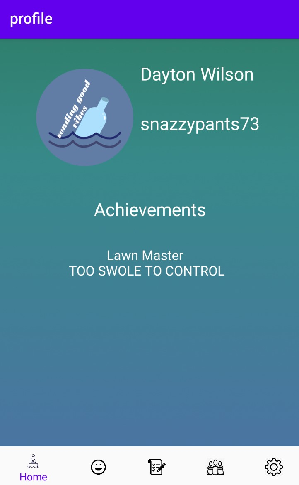
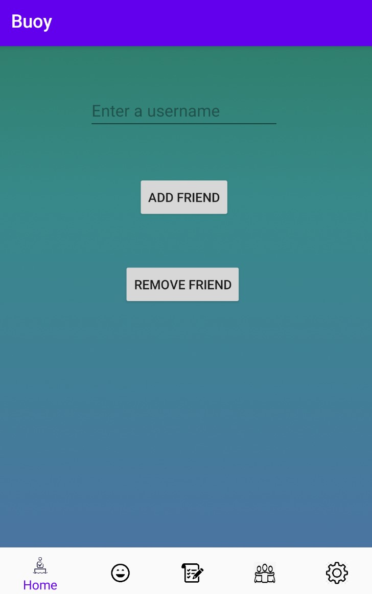
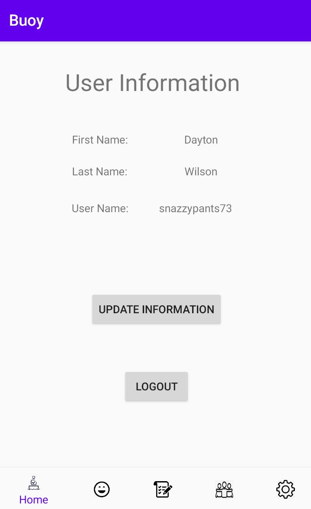

# Buoy
A motivational to-do list Android app where users can post encouraging messages (float buoys) onto their friends' tasks to help inspire them to complete their tasks

## Screenshots

At login, users provide an email and a password to either log in or create an account.

The landing page is the user's home feed which displays the soonest-expiring tasks for each of their friends.  From here, the user can send a friend a motivational message for their task (aka "floating a buoy").
Each activity also features a functional navigation bar for seamlessly transitioning between screens.

Send buoy dialog box

The list screen features buttons to create new lists and tasks within those lists (or delete them), and these tasks feature due dates.  Once enough tasks of a given category (e.g. "Fitness") are marked complete, the user is awarded an achievement which is displayed on their profile page.  This is a good feature for user engagement, as it promotes healthy competition between friends.

The buoys that have been sent to the user by their friends are also visible by tapping on the task to which the buoys have been floated.

The user's profile displays their name and username, as well as any achievements they have accrued.

From this activity, the user is able to add or remove friends by inputting an exact username. This is similar to the system used by apps like Discord; we felt this was a good decision in order to avoid having users spam strangers with buoys.

Finally, the settings screen is where the user can update their information if need be.
